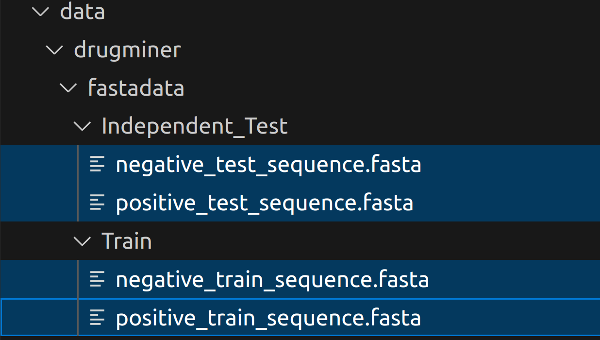
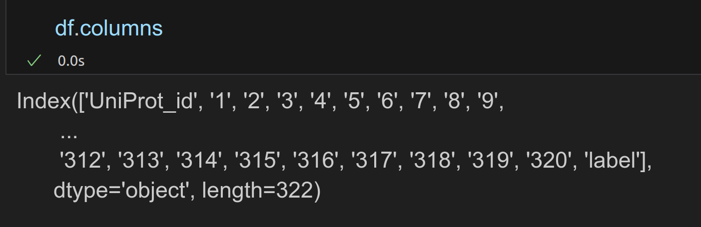
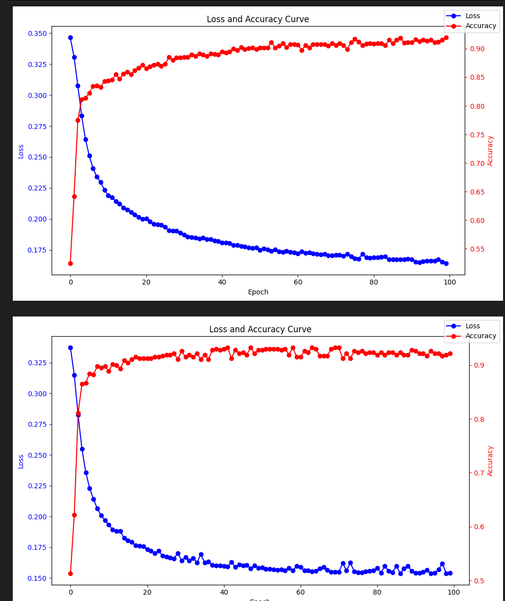
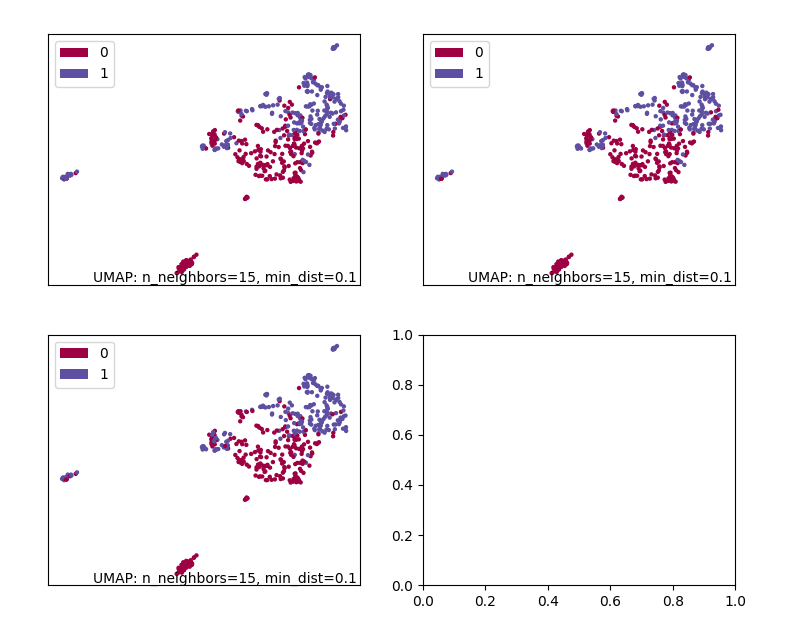
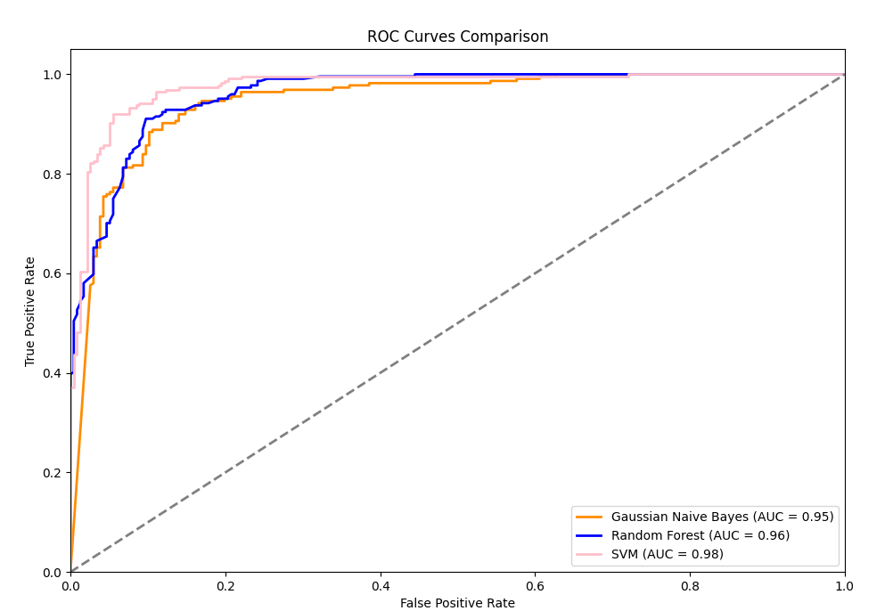

This is the scripts for Jamali database

# About the data

The data is under `data/drugminer/fasatadata`, relative data is retrived from drugfinder, which has a github repo. Mu zhang use the data from Jamali, i just download the data from that [repo]([GitHub - Melo-1017/DrugFinder: DrugFinder: druggable protein identification model based on pre-trained models and evolutionary information](https://github.com/Melo-1017/DrugFinder)).

In this folder, the training script is with `.ipynb` suffix, for example, cnn_train.ipynb to used to train a cnn architecute. And `.py` suffix is used for reference to see the model performance, you may use some `.pt` files under this folder.

## About the embedding

Best results are achieved by esm2 embedding, which use `data/drugminer/esm2_320_dimensions_with_labels.csv`, the processing script is also under that folder. This embedding is 320 dimensional vector, the pandas dataframe is look like this.

If you are interested in the embedding, you can also use other embedding to generate 640 dimensional vector or 1280 dimensional vector. But this is quite time consuming and memory consuming. Additionly, you may change the model a little bit if you use other embedding. 320 dimension is good enough.  

# About the model

We use many models, from traditional machine learning algorithms to deep learning methods(Cnn, lstm, svm, random forest, etc.) Some of them just use 320 dimensional embedding mentioned below, namely `data/drugminer/esm2_320_dimensions_with_labels.csv`, others may use one hot encoding or dictionary encoding with linear layer which pad or truncate the protein sequence to 320, these model performance is quite poor. But those esm embedding are quite well.

# About the training and analysis

Typically, training these models is not so gpu consuming, you can easily run them in google colab, they may trained for 100, 300, 500 epoches. Related evaluation indicators like f1 socre, mcc, recall, acc, auc is also calculated.

